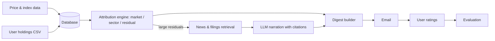

# Architecture (first sketch)

```mermaid
flowchart LR
  A[Price & index data] --> D[(Database)]
  B[User holdings CSV] --> D
  D --> E[Attribution engine: market / sector / residual]
  E -->|large residuals| F[News & filings retrieval]
  F --> G[LLM narration with citations]
  E --> H[Digest builder]
  G --> H
  H --> I[Email]
  I --> J[User ratings] --> K[Evaluation]
```

Rule: the attribution engine (plain math) decides what happened. The LLM only narrates from retrieved sources.